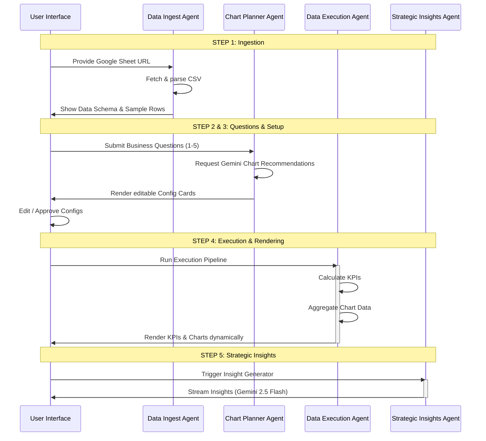

# ShopEasy Data Analyst Agent - Multi-Agent Architecture

This document defines the agent roles, interfaces, and cooperation flow for the **ShopEasy Data Analyst Agent** dashboard. Because this is a client-side web application, each agent is implemented as a modular, stateful JavaScript agent class that logs operations to the **Agent Operations Console**, updates the **Agent Status Panel**, and interacts with APIs or data sources.

---

## Agent Definitions

### 1. Data Ingest Agent (`DataIngestAgent`)
*   **Role**: Ingests raw data from external sources and parses it into a structured schema.
*   **Responsibilities**:
    *   Fetch the raw CSV data from the provided Google Sheet CSV URL.
    *   Parse CSV data safely (handling quotes, commas, and newlines).
    *   Perform automatic column type detection:
        *   `date`: Values matching `DD-MM-YYYY`.
        *   `number`: Clean numeric values (ignoring currency symbols like `$` or commas).
        *   `category`: String fields with low cardinality (relative to total rows).
        *   `text`: General free-form text.
    *   Calculate metadata: row count, column list, and date range (if date column exists).
    *   Extract a 3-row sample for schema preview.
*   **Inputs**: Google Sheet CSV URL (string).
*   **Outputs**:
    *   `rawData`: Array of parsed rows (objects).
    *   `schema`: Dictionary of `columnName -> dataType`.
    *   `metadata`: Total row count, date range start/end, list of column names.
    *   `sampleRows`: Array of first 3 rows.

### 2. Chart Planner Agent (`ChartPlannerAgent`)
*   **Role**: Consults Gemini 2.5 Flash to recommend optimal visualizations for the user's business questions.
*   **Responsibilities**:
    *   Take the parsed schema and user-submitted questions.
    *   Construct a structured system prompt for Gemini 2.5 Flash.
    *   Query Gemini 2.5 Flash to recommend:
        *   Chart Type (`bar`, `line`, `donut`, `scatter`, etc.).
        *   X-Axis Column (appropriate data type).
        *   Y-Axis Column (appropriate data type, numeric).
        *   Short reasoning (one sentence) explaining why this chart answers the question.
    *   Provide structured JSON configuration matching the recommendations.
*   **Inputs**: Schema metadata, User Questions (array of strings, size 1-5).
*   **Outputs**:
    *   `chartRecommendations`: Array of objects containing `{ question, chartType, xAxisColumn, yAxisColumn, reasoning }`.

### 3. Data Execution Agent (`DataExecutionAgent`)
*   **Role**: Aggregates, filters, and formats raw data to feed the rendering engine and calculates overall KPIs.
*   **Responsibilities**:
    *   Calculate global KPIs:
        *   **Total Revenue**: Sum of values in a column containing "revenue" or "sales" or "amount" (case-insensitive).
        *   **Total Orders**: Total row count or count of unique Order IDs.
        *   **Average Delivery Days**: Average of difference or pre-calculated days if columns containing "delivery" or "ship" and "days" exist.
    *   Perform data aggregation for each chart based on the confirmed configurations:
        *   For `bar`/`donut` (categorical X, numeric Y): Group by X, sum or average Y.
        *   For `line` (date or sequential X, numeric Y): Parse dates, group by X (e.g. week, day), sort chronologically, sum/average Y.
        *   For `scatter` (numeric X, numeric Y): Map individual coordinates.
    *   Format data into structure expected by the charting library (e.g., Chart.js datasets).
*   **Inputs**: `rawData`, `schema`, Confirmed Chart Configurations.
*   **Outputs**:
    *   `kpis`: Object containing `{ totalRevenue, totalOrders, avgDeliveryDays }`.
    *   `chartData`: Array of structured datasets ready for chart rendering.

### 4. Strategic Insights Agent (`StrategicInsightsAgent`)
*   **Role**: Generates actionable, number-backed business insights from the dashboard's results.
*   **Responsibilities**:
    *   Analyze the calculated KPIs and aggregated chart datasets.
    *   Construct a comprehensive business context prompt for Gemini 2.5 Flash.
    *   Query Gemini 2.5 Flash with streaming enabled.
    *   Enforce constraints:
        *   Maximum 5 insights.
        *   No technical jargon (written for a business leader).
        *   Each insight must include at least one specific metric or number from the dataset.
        *   Identify an issue and recommend an immediate action.
*   **Inputs**: KPIs, aggregated chart datasets, user questions, schema.
*   **Outputs**:
    *   Streamed text chunks of insights (directly rendered into the UI bullet-by-bullet).

---

## Agent Cooperation & Pipeline Flow

The dashboard orchestrates the agents in a strict pipeline:

